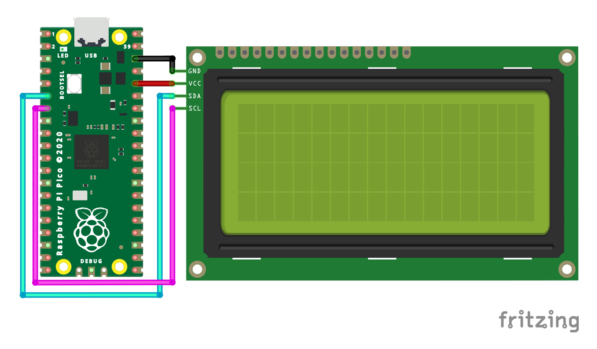

# Raspberry Pi Pico - I2C Liquid Crystal Display Library

This repository contains a Raspberry Pi Pico library using its SDK writen for the Liquid Crystal Displays that are equiped with an I2C module. It also contains two examples for two different types of LCDs. Below are the instructions on how to build them.

## Examples

After you clone the repo you run the following commands to build them. You have to have installed *CMake* and *Make*. Also you need to have the SDK on your system and point `PICO_SDK_PATH` to it.
```sh
export PICO_SDK_PATH='/Path/to/SDK'
```
```sh
cd Pico-I2C-LCD/examples
```
```sh
mkdir build
```
```sh
cd build
```
```sh
cmake ..
```
```sh
make -j4
```
### How to connect the LCD to the board

